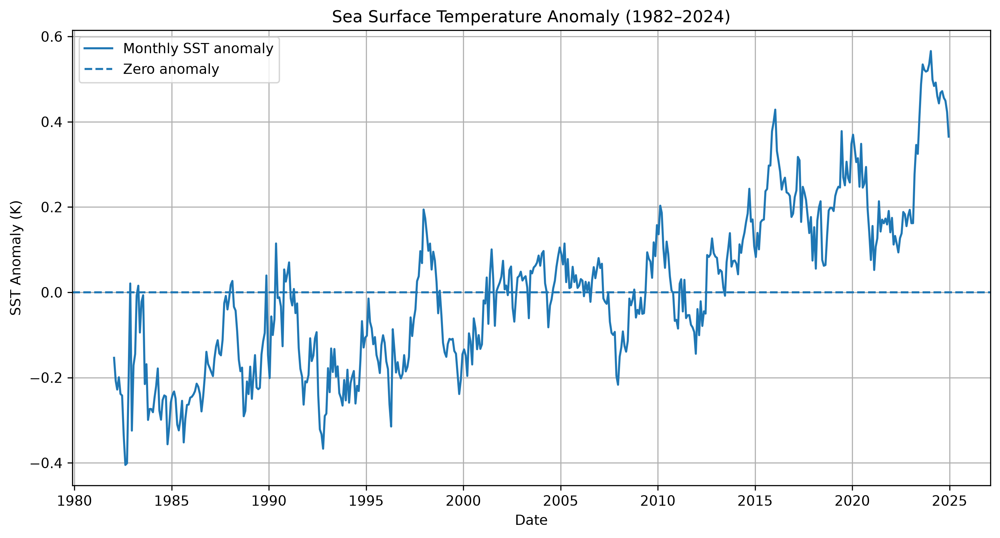
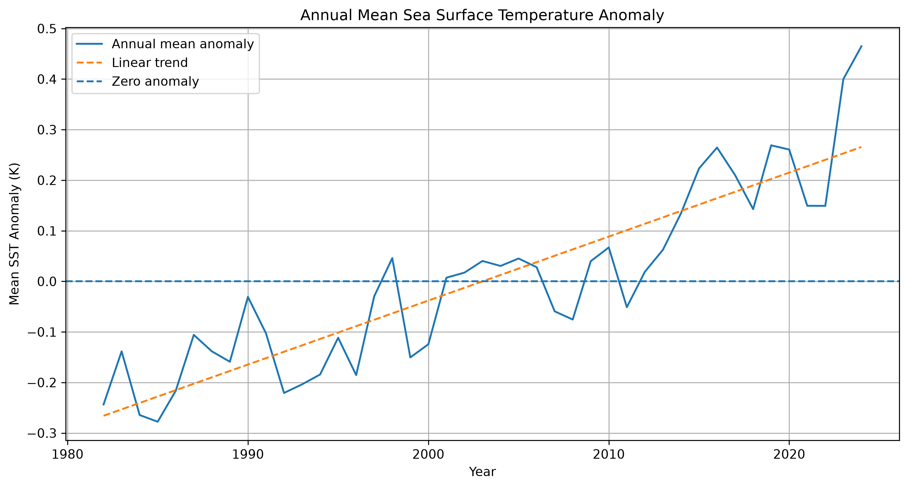
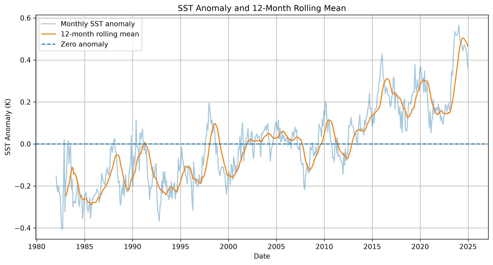

# <h1 align="center">**Sea Surface Temperature Anomaly Analysis**</h1> 

A Python project using Sea Surface Temperature (SST) anomaly data from 1982 to 2024.

The goal is to explore how SST anomalies vary over time, investigate long-term trends, and analyze patterns within an oceanographic dataset.

## Overview

This project was developed as an introduction to oceanographic data analysis with Python. Monthly SST anomaly data were processed using Pandas, Matplotlib and SciPy for data preparation, statistical analysis, visualization and trend estimation.

## Dataset

The dataset contains monthly Sea Surface Temperature anomaly observations from 1982 to 2024. The data were obtained from the Copernicus Marine Service Ocean Climate Portal.

[Source: Copernicus Marine Service — Sea Surface Temperature](https://marine.copernicus.eu/ocean-climate-portal/sea-surface-temperature)

<table align="center">
  <tr>
    <th>Variable</th>
    <th>Description</th>
  </tr>
  <tr>
    <td><code>date</code></td>
    <td>Date of the observation</td>
  </tr>
  <tr>
    <td><code>sst_anomaly</code></td>
    <td>Sea Surface Temperature anomaly (K)</td>
  </tr>
  <tr>
    <td><code>year</code></td>
    <td>Year extracted from the date</td>
  </tr>
  <tr>
    <td><code>month</code></td>
    <td>Month extracted from the date</td>
  </tr>
  <tr>
    <td><code>rolling_12m</code></td>
    <td>12-month rolling mean</td>
  </tr>
  <tr>
    <td><code>period</code></td>
    <td>Predefined time period</td>
  </tr>
</table>

## Analysis

The first step was to prepare the dataset using Pandas. Dates were converted to datetime format, and year and month were extracted from the original date column.
Basic statistics were calculated to obtain the mean, maximum and minimum SST anomalies. The monthly data were grouped by year to calculate the annual mean anomaly. These values were then used in a linear regression to estimate the overall trend from 1982 to 2024.

The analysis also includes a monthly comparison, a 12-month rolling mean, and a comparison between different periods. The 10 years with the highest and lowest annual mean anomalies were also identified.

For the period comparison, the dataset was divided into:

<table align="center">
  <tr>
    <th>Period</th>
    <th>Years</th>
  </tr>
  <tr>
    <td>1</td>
    <td>1982–1999</td>
  </tr>
  <tr>
    <td>2</td>
    <td>2000–2009</td>
  </tr>
  <tr>
    <td>3</td>
    <td>2010–2019</td>
  </tr>
  <tr>
    <td>4</td>
    <td>2020–2024</td>
  </tr>
</table>

Monthly observations were also classified as positive, negative or zero anomalies.

## Visualisations

### Monthly SST Anomaly

Monthly SST anomaly observations from 1982 to 2024.

  

### Annual SST Trend

Annual mean SST anomalies and the estimated linear trend.

  

### 12-Month Rolling Mean

Monthly SST anomalies together with the 12-month rolling mean.

  

## Key Findings

The main results are stored in `sst_summary.csv`. This section will be updated with the main findings from the analysis, including the overall trend, R², p-value, highest and lowest anomaly years, and differences between the selected periods.

## Output Files

<table align="center">
  <tr>
    <th align="center">File</th>
    <th align="center">Description</th>
  </tr>
  <tr>
    <td align="center"><code>annual_sst_anomalies.csv</code></td>
    <td align="center">Annual mean SST anomalies</td>
  </tr>
  <tr>
    <td align="center"><code>monthly_sst_anomalies.csv</code></td>
    <td align="center">Mean anomaly by calendar month</td>
  </tr>
  <tr>
    <td align="center"><code>period_sst_anomalies.csv</code></td>
    <td align="center">Mean anomaly by predefined period</td>
  </tr>
  <tr>
    <td align="center"><code>sst_summary.csv</code></td>
    <td align="center">Main statistical results</td>
  </tr>
</table>

## Scientific Context

Sea Surface Temperature is an important variable in oceanography and climate studies. SST anomalies show how observed sea surface temperatures differ from a reference climatology. Studying these anomalies can help investigate changes in ocean conditions and their relationship with marine ecosystems, ocean circulation, climate variability and marine heatwaves.

## Technologies

_Python_ was used as the main programming language.

_Pandas_ was used for data cleaning, transformation and organization.

_Matplotlib_ was used to create the visualizations.

_SciPy_ was used for linear regression and statistical analysis.

## Skills Demonstrated

Python - Pandas - Data Cleaning - Exploratory Data Analysis - Time-Series Analysis - Statistics - Linear Regression - Data Visualisation - Scientific Data Analysis - Oceanographic Data

## Project Status

_Completed_ - Python analysis

Next stage: SQL integration and Tableau dashboard.

## Author

### Mariana Gomes de Andrade Silva

Oceanographic and environmental data analysis portfolio.

**Interests: Oceanography - Geophysics - Climate Science - Remote Sensing - Geospatial Data - Scientific Programming - Data Analysis**
